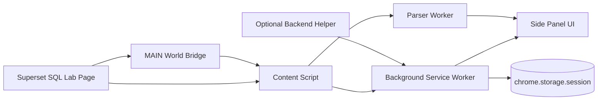
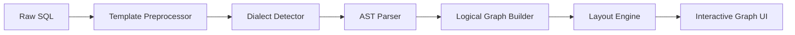

# Superset Query Visualizer 설계 문서

## 1. 배경

Apache Superset SQL Lab은 강력하지만, 쿼리가 길어질수록 다음 문제가 반복됩니다.

- CTE가 여러 단계로 중첩되면 데이터 흐름을 텍스트만으로 추적하기 어렵다.
- JOIN, FILTER, AGGREGATION의 순서를 머릿속에서 재구성해야 한다.
- 실행 시간이 길어져도 어떤 구간이 병목인지 감으로만 추정하게 된다.
- 팀 내 리뷰 시 "이 쿼리가 실제로 무엇을 하고 있는지" 설명 비용이 커진다.

사용자는 SQL Lab 안에서 쿼리를 작성하고 실행하는 흐름을 유지한 채, 별도 패널에서 구조를 빠르게 파악하고 싶다.

## 2. 문제 정의

목표는 "복잡한 SQL을 논리 흐름 그래프로 보여주는 크롬 익스텐션"이다. 여기서 중요한 것은 두 가지다.

1. Superset 서버를 수정할 수 없는 환경에서도 동작해야 한다.
2. 단순 prettify가 아니라, 실제 분석에 도움이 되는 구조화된 그래프를 제공해야 한다.

즉, 이 프로젝트는 SQL formatter가 아니라 SQL Lab 보조 분석 도구다.

## 3. 목표와 비목표

### 3.1 목표

- SQL Lab에서 현재 편집 중인 SQL을 읽어온다.
- CTE, 서브쿼리, 테이블, JOIN, FILTER, GROUP BY, HAVING, UNION, ORDER BY, LIMIT를 그래프로 표현한다.
- 쿼리 텍스트와 그래프 노드를 양방향 하이라이트한다.
- Superset 실행 이벤트를 감지해 실행 상태, duration, row count, estimate 등 메타데이터를 표시한다.
- 쿼리가 갱신될 때 패널이 자동으로 재분석된다.

### 3.2 비목표

- 모든 데이터베이스 dialect에서 100% 정확한 physical execution plan을 보장하지 않는다.
- Superset 내부 코드를 직접 수정하는 것을 필수 전제로 두지 않는다.
- SQL 최적화 조언 엔진을 1차 릴리스에 포함하지 않는다.
- 대규모 lineage 플랫폼처럼 cross-query, cross-dashboard 전체 계보를 다루지 않는다.

## 4. 제품 형태 비교

| 선택지 | 장점 | 단점 | 판단 |
| --- | --- | --- | --- |
| Superset native extension | SQL Lab 내부 상태 접근이 쉽고 안정적 | 서버 배포 권한 필요 | 관리 가능한 사내 Superset이면 최선 |
| Pure Chrome extension | 배포가 쉽고 서버 수정이 불필요 | 페이지 상태 접근과 동기화가 까다롭다 | 외부/호스팅 Superset 대상에 적합 |
| Hybrid | 브라우저만으로 시작하고, 필요 시 서버 helper 추가 가능 | 설계 복잡도가 조금 높다 | 권장 |

## 5. 권장 아키텍처

이 문서는 `Hybrid`를 기본안으로 채택한다.

- 기본 제품은 Chrome Extension으로 제공한다.
- 기본 동작은 브라우저 내부에서 끝난다.
- 정밀한 parser, rendered SQL, `EXPLAIN` 수집이 필요하면 optional helper를 붙인다.

이 선택의 이유는 다음과 같다.

- 사용자는 Superset 인스턴스를 직접 운영하지 않을 수 있다.
- 반대로 사내 환경에서는 native extension이나 helper를 붙일 여지도 남겨야 한다.
- 1차 제품은 배포 장벽이 낮아야 검증이 빠르다.

## 6. 상위 사용자 시나리오

### 6.1 시나리오 A: 긴 CTE 체인 파악

사용자는 SQL Lab에서 300줄짜리 쿼리를 열고 사이드 패널을 연다. 패널은 CTE 간 의존성 그래프를 보여주고, 특정 CTE를 클릭하면 SQL 텍스트의 해당 범위가 강조된다.

### 6.2 시나리오 B: 병목 후보 추정

사용자가 쿼리를 실행하면 패널은 실행 시작/종료 이벤트를 감지한다. 결과 수, 실행 시간, 추정 row 규모 등을 노드 배지나 요약 카드로 표시한다.

### 6.3 시나리오 C: 템플릿 SQL 디버깅

Jinja가 포함된 쿼리도 완전히 실패시키지 않고, 템플릿 구간을 placeholder node로 표시하거나 rendered SQL을 사용할 수 있는 경우 대체해 분석한다.

## 7. 시스템 개요



### 7.1 구성요소

- `side panel UI`
  - 그래프 렌더링
  - 실행 요약 카드
  - 노드 상세 패널
  - 설정 UI
- `content script`
  - SQL Lab 페이지 감지
  - DOM 변화 감시
  - 네트워크 이벤트 감시
  - page bridge와 background 사이 메시지 중계
- `MAIN world bridge`
  - 페이지 JS 컨텍스트에 접근이 필요한 최소 코드
  - Monaco editor 값, Redux store, fetch/XHR hook 등 페이지 내부 상태 접근
  - `window.postMessage` 또는 DOM event로 content script와 통신
- `background service worker`
  - 탭 단위 세션 상태 관리
  - side panel 활성화 제어
  - 메시지 라우팅
  - 선택형 helper API 호출
- `parser worker`
  - SQL 전처리
  - dialect 감지
  - AST 생성
  - DAG 모델 변환
  - 성능 분리를 위한 Web Worker
- `optional backend helper`
  - rendered SQL 생성
  - 복잡한 dialect 파싱
  - DB별 `EXPLAIN` 수집

## 8. 크롬 익스텐션 구조

### 8.1 Manifest V3 기준

필수 권한 초안:

- `sidePanel`
- `storage`
- `scripting`
- `tabs`

선택 권한 초안:

- `optional_host_permissions`
  - 사용자가 연결을 허용한 Superset origin만 요청

권장 `manifest` 구성 예시:

```json
{
  "manifest_version": 3,
  "name": "Superset Query Visualizer",
  "version": "0.1.0",
  "minimum_chrome_version": "116",
  "permissions": ["sidePanel", "storage", "scripting", "tabs"],
  "optional_host_permissions": ["https://*/*", "http://*/*"],
  "background": {
    "service_worker": "background.js",
    "type": "module"
  },
  "side_panel": {
    "default_path": "sidepanel.html"
  },
  "content_scripts": [
    {
      "matches": ["https://*/*", "http://*/*"],
      "js": ["content.js"],
      "run_at": "document_idle"
    }
  ],
  "web_accessible_resources": [
    {
      "resources": ["page-bridge.js"],
      "matches": ["https://*/*", "http://*/*"]
    }
  ]
}
```

주의:

- 실제 배포 시 `matches`와 `optional_host_permissions`는 가능한 한 좁혀야 한다.
- 제품 UX는 "설정 페이지에서 Superset origin 등록 -> 권한 요청" 흐름을 권장한다.

### 8.2 서비스 워커 제약 대응

MV3 service worker는 상시 살아 있지 않다. 따라서 탭 상태는 in-memory만 두면 유실될 수 있다.

권장 전략:

- 최근 분석 결과와 탭 세션 스냅샷은 `chrome.storage.session`에 저장한다.
- side panel이 열려 있을 때는 long-lived port를 사용한다.
- 재기동 후에도 마지막 그래프를 빠르게 복원할 수 있게 한다.

## 9. Superset 연동 방식

### 9.1 SQL Lab 페이지 감지

페이지 감지는 하나의 신호에 의존하지 않는다.

- URL 패턴
- SQL Lab 에디터 DOM 존재 여부
- `/api/v1/sqllab/` 계열 네트워크 요청 존재 여부

이유:

- Superset 버전과 배포 방식에 따라 라우팅 구조가 달라질 수 있다.
- DOM 마커와 API 트래픽을 함께 보는 편이 견고하다.

### 9.2 현재 SQL 가져오기

우선순위는 다음과 같다.

1. Monaco editor 또는 SQL 입력 컴포넌트에서 현재 문자열 직접 읽기
2. 페이지 상태 저장소에서 현재 탭 SQL 읽기
3. 최근 실행 요청 payload에서 SQL 복원

이 중 1번과 2번은 페이지 JS world 접근이 필요할 수 있다. content script는 isolated world이므로, 페이지 상태를 직접 읽기보다 `MAIN world bridge`를 통해 최소 정보만 전달받는다.

### 9.3 실행 이벤트 감지

감지 대상:

- execute 시작
- estimate 요청
- 결과 polling 또는 결과 fetch
- 성공, 실패, 취소

수집 메타데이터:

- query id
- 실행 시작/종료 시각
- status
- duration
- row count
- database id
- schema
- rendered SQL 여부

### 9.4 네이티브 Superset 연동 대안

Superset은 SQL Lab panel extension point와 frontend extension API를 제공한다. 따라서 배포 권한이 있는 환경에서는 별도 크롬 익스텐션 없이 SQL Lab 내부 패널로 구현할 수 있다.

하지만 본 프로젝트는 "배포 권한이 없는 사용자도 설치해서 쓴다"는 전제를 우선하므로, native extension은 선택 경로로만 둔다.

## 10. SQL 분석 파이프라인

### 10.1 처리 단계



### 10.2 전처리

전처리 책임:

- Jinja 블록 치환
- 주석 제거 또는 보존 전략 결정
- 세미콜론 단위 statement 분리
- span 정보 유지

핵심 요구사항은 "원본 SQL 위치 정보"를 잃지 않는 것이다. 그래프 노드를 클릭했을 때 SQL 원문 범위를 하이라이트해야 하기 때문이다.

예시 전략:

- `{{ metric('revenue') }}` -> `__TPL_EXPR_1__`
- `` 블록 -> `__TPL_BLOCK_1__`
- 치환 맵을 유지해 UI에서 "template placeholder"로 설명

### 10.3 dialect 감지

초기 입력:

- Superset의 database engine 정보
- SQL 문법 힌트
- parser 성공/실패 결과

MVP 정책:

- 기본 parser는 범용 dialect로 시도
- 실패 시 database engine 기반 parser 재시도
- 그래도 실패하면 partial graph 모드로 다운그레이드

### 10.4 AST parser 선택

MVP 추천:

- 브라우저 내 parser 1차 선택: `node-sql-parser` 또는 동급 JS parser
- 이유: 확장 내부에서 바로 실행 가능하고 초기 속도가 빠름

중기 대안:

- helper 서비스 또는 WASM 기반 `sqlglot` 계열 parser
- 이유: dialect 범위와 변환 품질이 더 중요해지는 시점이 온다

정리:

- MVP는 "빠르게 돌아가는 parser"를 쓴다.
- 제품화 단계에서는 "dialect coverage가 좋은 parser"로 옮길 여지를 설계에 남긴다.

### 10.5 Logical Graph Builder

그래프 노드 타입:

- `statement`
- `cte`
- `subquery`
- `source_table`
- `join`
- `filter`
- `aggregate`
- `window`
- `union`
- `sort`
- `limit`
- `template`
- `result`

그래프 엣지 타입:

- `depends_on`
- `reads_from`
- `transforms_to`
- `joins_with`
- `feeds_result`

그래프 구성 원칙:

- 쿼리 계획을 DB 내부 실행 노드처럼 과도하게 흉내 내지 않는다.
- 사용자가 SQL을 읽는 순서가 아니라 "데이터가 변형되는 흐름" 중심으로 표현한다.
- 너무 세밀한 노드 분해는 피하고, 클릭 시 상세 패널에서 확장한다.

### 10.6 Partial Graph 모드

복잡한 dialect 또는 parse failure를 위해 예외 모드를 둔다.

- CTE 경계만 추출
- FROM/JOIN 대상만 추출
- SELECT 블록 단위만 시각화

이 모드는 정확도가 낮더라도 "전체 구조를 대략 파악"하는 데 가치를 준다.

## 11. 시각화 설계

### 11.1 UI 레이아웃

사이드 패널 기본 레이아웃:

1. 상단 요약 바
2. 그래프 캔버스
3. 우측 또는 하단 노드 상세 패널
4. 하단 이벤트 로그

### 11.2 핵심 인터랙션

- 그래프 노드 클릭 -> SQL 에디터에서 해당 span 강조
- SQL 텍스트 선택 -> 대응 노드 강조
- 실행 직후 변경된 쿼리와 이전 쿼리 diff 비교
- 큰 그래프는 CTE 그룹 단위 접기/펼치기
- 실패한 parser 단계는 사용자에게 명확히 표시

### 11.3 레이아웃 엔진

MVP:

- `React Flow` + `Dagre`

고도화:

- 큰 DAG와 군집 배치가 필요하면 `ELK.js`

선정 이유:

- 구현 속도와 유지보수를 우선하면 Dagre가 빠르다.
- 수백 노드 규모의 가독성은 ELK가 더 낫다.

## 12. 데이터 모델 초안

```ts
export interface QuerySession {
  tabId: number;
  supersetOrigin: string;
  sql: string;
  normalizedSql: string;
  databaseEngine?: string;
  lastExecution?: ExecutionMeta;
  graph?: QueryGraph;
  parseStatus: "idle" | "parsing" | "ok" | "partial" | "error";
  updatedAt: number;
}

export interface ExecutionMeta {
  queryId?: string;
  status: "running" | "success" | "failed" | "canceled";
  startedAt?: number;
  finishedAt?: number;
  durationMs?: number;
  rowCount?: number;
  errorMessage?: string;
}

export interface QueryGraph {
  nodes: GraphNode[];
  edges: GraphEdge[];
}

export interface GraphNode {
  id: string;
  type:
    | "statement"
    | "cte"
    | "subquery"
    | "source_table"
    | "join"
    | "filter"
    | "aggregate"
    | "window"
    | "union"
    | "sort"
    | "limit"
    | "template"
    | "result";
  label: string;
  sqlSpan?: { start: number; end: number };
  meta?: Record<string, unknown>;
}

export interface GraphEdge {
  id: string;
  source: string;
  target: string;
  type: "depends_on" | "reads_from" | "transforms_to" | "joins_with" | "feeds_result";
}
```

## 13. 메시지 프로토콜 초안

권장 이벤트:

- `SUPERSET_PAGE_DETECTED`
- `QUERY_SNAPSHOT_UPDATED`
- `QUERY_EXECUTION_STARTED`
- `QUERY_EXECUTION_FINISHED`
- `QUERY_EXECUTION_FAILED`
- `GRAPH_BUILD_REQUESTED`
- `GRAPH_BUILD_COMPLETED`
- `GRAPH_BUILD_FAILED`
- `NODE_SELECTED`
- `SQL_SPAN_SELECTED`

통신 원칙:

- page bridge <-> content script: `window.postMessage`
- content script <-> background: `chrome.runtime.sendMessage` 또는 `Port`
- background <-> side panel: `Port`

이렇게 계층을 나누는 이유는 페이지 world와 익스텐션 world의 경계를 명확히 유지하기 위해서다.

## 14. 옵션 helper 설계

브라우저만으로 해결하기 어려운 문제는 helper로 분리한다.

대상 문제:

- Jinja render 결과 확보
- 복잡한 dialect 파싱
- DB별 `EXPLAIN` 실행
- plan cost, scanned bytes, partitions 등 엔진별 메타데이터 정규화

helper 방식 후보:

| 방식 | 장점 | 단점 |
| --- | --- | --- |
| Local helper server | 사용자 로컬에서 동작 가능 | 설치 부담 |
| Superset backend plugin | 가장 정확한 맥락 접근 | 서버 권한 필요 |
| Remote API | 관리가 쉽다 | 보안 검토 필요 |

권장 우선순위:

1. 브라우저 단독 MVP
2. 로컬 helper
3. 사내 환경용 Superset backend plugin

## 15. 보안 및 개인정보

### 15.1 기본 원칙

- SQL 텍스트는 기본적으로 로컬에서만 처리한다.
- 외부 서버 전송은 명시적 opt-in일 때만 허용한다.
- 사용자가 허용한 Superset origin 외에는 동작하지 않는다.

### 15.2 민감 정보 처리

주의 대상:

- SQL 안의 고객 식별자
- 내부 테이블명과 스키마명
- Jinja 매크로에 포함된 민감 파라미터

대응:

- 원본 SQL 영구 저장 금지
- 디버그 로그 마스킹
- helper 사용 시 redaction 옵션 제공

### 15.3 권한 최소화

- `host_permissions`는 optional permission으로 요청
- 특정 origin만 등록
- broad match는 개발 단계에만 허용

## 16. 성능 요구사항

목표:

- 300줄 이하 SQL은 1초 이내 최초 그래프 표시
- 편집 중 재분석은 300ms~500ms debounce
- 그래프 노드 150개 수준까지 부드러운 pan/zoom 유지

전략:

- parser는 Web Worker에서 수행
- 쿼리 해시 기반 캐시
- 동일 SQL 재분석 스킵
- 레이아웃은 incremental update 지원

## 17. 오류 처리와 관측성

사용자가 이해해야 할 실패 유형:

- SQL Lab 페이지를 감지하지 못함
- 현재 SQL을 읽지 못함
- parser 실패
- partial graph 모드로 강등
- 실행 메타데이터 수집 실패

UI 원칙:

- 침묵 실패 금지
- 실패 위치와 원인을 상단 상태 바에 짧게 노출
- 그래프 생성 실패 시 raw AST 또는 진단 메시지를 볼 수 있게 함

개발 관측성:

- debug mode에서 이벤트 타임라인 출력
- parser 성공률, partial fallback 비율 집계

## 18. 구현 단계 제안

### Phase 0. 기술 검증

- SQL Lab 감지
- 현재 SQL 추출
- side panel 열기

완료 기준:

- Superset 페이지에서 현재 쿼리 문자열을 안정적으로 패널에 표시

### Phase 1. Logical Graph MVP

- SQL 전처리
- AST 파싱
- CTE/JOIN/FILTER/GROUP BY 시각화

완료 기준:

- 단순 CTE 3~5단 구조를 문제없이 그래프로 표현

### Phase 2. 상호작용 강화

- SQL span <-> 노드 양방향 하이라이트
- 접기/펼치기
- partial graph fallback

완료 기준:

- 사용자가 텍스트와 그래프를 오가며 쿼리 구조를 탐색 가능

### Phase 3. 실행 메타데이터

- execute/estimate/results 감지
- 실행 시간, row count, status 표시

완료 기준:

- 실행 후 패널에 상태와 요약 메타데이터 표시

### Phase 4. Helper 연동

- rendered SQL
- DB별 `EXPLAIN`
- cost overlay

완료 기준:

- 지원 DB에 한해 물리 실행 계획 또는 비용 정보를 병합 표시

## 19. 권장 기술 스택

### 19.1 프론트엔드

- TypeScript
- React
- Vite
- React Flow
- Zustand 또는 Redux Toolkit

### 19.2 파싱/분석

- MVP: `node-sql-parser` 계열
- 고도화: `sqlglot` helper 또는 WASM 대안 검토

### 19.3 테스트

- Vitest
- Playwright

테스트 범위:

- SQL fixture 기반 parser snapshot
- Superset mock page 기반 DOM integration test
- 실제 Superset dev 환경 E2E

## 20. 권장 소스 트리

```text
extension/src/
├── background/
│   ├── index.ts
│   ├── sessionStore.ts
│   └── sidePanelController.ts
├── bridge/
│   └── pageBridge.ts
├── content/
│   ├── index.ts
│   ├── pageDetector.ts
│   ├── sqlCollector.ts
│   └── networkObserver.ts
├── parser/
│   ├── preprocess.ts
│   ├── dialect.ts
│   ├── graphBuilder.ts
│   └── partialFallback.ts
├── sidepanel/
│   ├── index.tsx
│   ├── App.tsx
│   ├── components/
│   └── store/
├── worker/
│   └── parser.worker.ts
└── shared/
    ├── messages.ts
    ├── schema.ts
    └── constants.ts
```

## 21. 오픈 이슈

- Superset 버전별 SQL Lab DOM 구조 차이를 어디까지 흡수할 것인가
- Monaco editor 접근이 막힌 배포에서 대체 경로는 충분한가
- Jinja render 결과를 helper 없이 얼마나 안정적으로 확보할 수 있는가
- database engine별 parser 품질 기준을 어떻게 측정할 것인가
- `EXPLAIN`을 generic 기능으로 제공할지, 엔진별 adapter로 분리할지

## 22. 결론

이 프로젝트의 현실적인 1차 성공 조건은 "복잡한 SQL의 논리 흐름을 빠르게 파악하게 만드는 것"이다.

따라서 구현 우선순위는 다음과 같다.

1. SQL Lab에서 현재 SQL을 안정적으로 가져온다.
2. 논리 DAG를 빠르게 그린다.
3. SQL 텍스트와 그래프를 연결한다.
4. 실행 메타데이터를 붙인다.
5. 그 다음에만 physical plan과 최적화 기능으로 확장한다.

이 순서를 지키면 배포 장벽이 낮고, 실제 사용자 가치가 빠르게 검증된다.

## 23. 참고 자료

- [msyavuz/superset-sql-visualizer](https://github.com/msyavuz/superset-sql-visualizer)
- [Superset SQL Lab extension points](https://superset.apache.org/developer_portal/extensions/extension-points/sqllab/)
- [Superset frontend extension API](https://superset.apache.org/developer_portal/api/frontend/)
- [Superset SQL Lab API](https://superset.apache.org/docs/api/sql-lab)
- [Superset SQL templating](https://superset.apache.org/user-docs/using-superset/sql-templating/)
- [Chrome Side Panel API](https://developer.chrome.com/docs/extensions/reference/api/sidePanel)
- [Chrome content scripts](https://developer.chrome.com/docs/extensions/develop/concepts/content-scripts)
- [Chrome manifest content scripts](https://developer.chrome.com/docs/extensions/reference/manifest/content-scripts)
